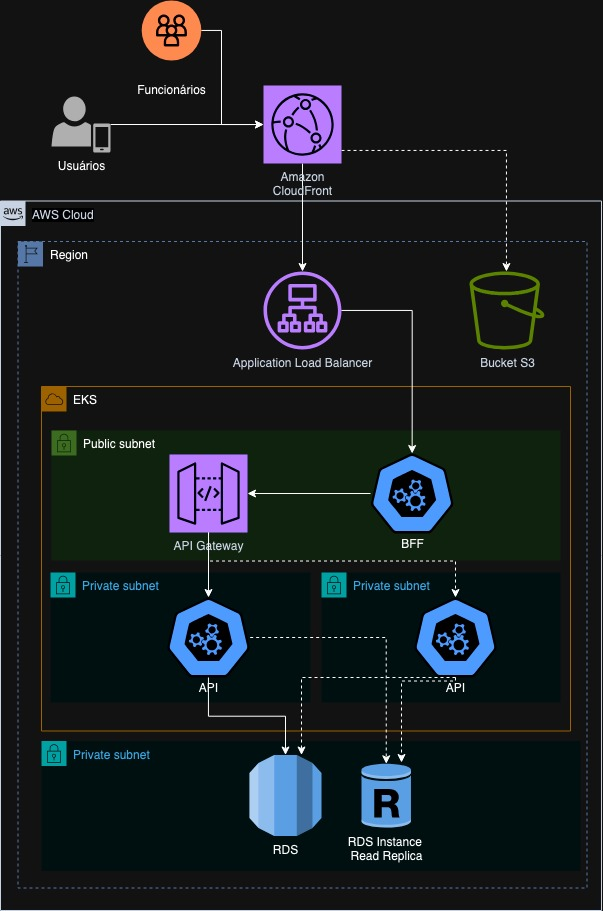

# 💬 Tech Challenge

## ✳️ Sobre
O **Tech Challenge** é um projeto de um sistema de autoatendimento de fast food, que é composto por uma série de dispositivos e interfaces que permitem aos clientes selecionar e fazer pedidos sem precisar interagir com um atendente.

---

## 🛠 Ferramentas Utilizadas
- [Node](https://nodejs.dev)
- [Express](https://expressjs.com/pt-br/)
- [PostgreSQL](https://www.postgresql.org/)
- [Prisma](https://www.prisma.io/)
- [Jest](https://jestjs.io)
- [k8s](https://kubernetes.io/pt-br/)
---

## 💻 Clonando o repositório

- Clone o projeto

  ```bash
  git clone https://github.com/FIAP-SOAT-G19/tech-challenge.git
  ````
---

## 🏠 Adicionando variáveis de ambiente (.env)
Existe o arquivo `.env.example` com todas as variáveis utilizadas para rodar o sistema. Faça uma cópia desse arquivo e renomeie a cópia para `.env` antes de executar o comando para iniciar a aplicação.
---

## Arquitetura do projeto


## ▶️ Executando o projeto
- Execute os seguintes comandos:
  ```bash
    kubectl apply -f k8s/db-deployment.yaml
    kubectl apply -f k8s/api-deployment.yaml
    kubectl apply -f k8s/metrics.yaml
  ```

- Utilize os comandos abaixo para encaminhar as conexões das portas locais para a portas dos pod's Kubernetes (o segundo comando é opcional)
  ```bash
    kubectl port-forward service/api-svc 3000:3000 &
    kubectl port-forward service/database-svc 5432:5432 &
  ```

- O Backend iniciará em [http://localhost:3000](http://localhost:3000)

---

## 🧩 Swagger
É possível acessar a documentação da API pelo [Swagger da API](http://localhost:3000/api-docs) e simular os endpoints

---

## ▶️ Vídeo do Projeto
Link do vídeo no [Youtube](https://youtu.be/TDvxi906vco?si=yY3aulSxq2tg5fiC)

---

## 🧪 Testes:
- Rodar todos os testes
  ```bash
  npm t
  ```
---

## 🚀 Commits no projeto

O projeto possui [husky](https://github.com/typicode/husky) para verificar alguns passos antes de autorizar o commit.

1. Aplicar correções relacionadas à **Lint**;
3. Validação da mensagem de commit conforme as regras do [conventional-commits](https://www.conventionalcommits.org/en/v1.0.0/);
  - Padrão no desenvolvimento de um card:
  > tipo(#numero_do_card): descrição em inglês (em letras minúsculas)
  - Padrão de desenvolvimento não relacionado a cards
  > tipo(escopo): descrição em inglês (em letras minúsculas)

Exemplos de tipos:
  - feat: introduz uma nova funcionalidade à base de código;
  - fix: correção de um bug na base de código;
  - build: Introduz uma mudança que afeta o build do sistema ou alguma dependência externa (exemplos de escopos: gulp, broccoli, npm);
  - chore: atualização de ferramentas, configurações e bibliotecas
  - ci: Introduz uma mudança aos arquivos e scripts de configuração do CI/CD (exemplos de escopos: Travis, Circle, BrowserStack, SauceLabs)
  - docs: Alterações na documentação
  - style: Introduz uma mudança que não afeta o significado do código (remoção de espaços em branco, formatação, ponto e virgula faltando, etc)
  - refactor: Uma mudança no código que nem corrige um bug nem adiciona uma nova funcionalidade
  - perf: Um mundança no código que melhora a performance
  - test: Adicionar testes faltando ou corrigir testes existentes

Exemplos de commits válidos:
  ```bash
  git commit -m "feat(#300): creating auth service"
  git commit -m "fix(#30): correcting product type"
  git commit -m "style(lint): removing some lint warnings"
  git commit -m "docs(readme): removing deploy section from readme"
  ```
---
